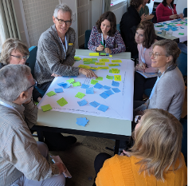

```{r, include = FALSE}
knitr::opts_chunk$set(
  collapse = TRUE,
  comment = "#>"
)
```

```{r setup}
library(dataitd24)
```

## 1. Background

The aim of the [FAIRqual project](https://fairqual.org/about) is to
develop both technological implementations and conceptual procedures for
sharing qualitative data based on the FAIR principles in
transdisciplinary (Td) research. As a first project activity, we were
interested in a broad collection of past and imagined experiences with
open data from transdisciplinary researchers and researchers interested
in transdisciplinary research. The International Transdisciplinary
Conference (ITD24) that took place in Utrecht NL between 04 and 08
November 2024 proved to be a unique opportunity to host such a workshop.
The following is a summary of the approach and results of the workshop.
Based on the results of the workshop, we will identify issues to be
further explored in expert interviews with e.g. Td researchers and
information specialists. The material collected from both the workshop
and the expert interviews will be used to develop a guide for Td
researchers on how to apply FAIR principles to qualitative data.
Accompanying activities will keep workshop participants and other
interested parties informed about the progress of the project and build
a community of practice.

## 2. Approach

### 2.1 Workshop procedure

At ITD24, the FAIRqual project team conducted a 90-minute workshop. The
workshop was attended by 24 people from the conference, including
experienced Td researchers, but also participants with a research/work
focus related to transdisciplinarity. The workshop began with a short
warm-up exercise, the completion of the informed consent form (see 2.2),
and an introductory presentation on the FAIR principles and open
research data in transdisciplinary research (PowerPoint slides available
at <https://fairqual.org/blog/posts/2024-12-05-itd24/>). For the first
part of the workshop, participants were divided into four groups, each
sitting at a separate table. On a flipchart (fig. 2), each table
discussed the same set of questions designed to reflect on lived and
imagined experiences of sharing qualitative data in transdisciplinary
research:

-   What kind of qualitative data do you use, wish to use, or imagine
    using in Td research?

-   How do you share, or imagine sharing this data and what are the
    benefits?

-   What challenges have you experienced, or can you imagine when
    sharing qualitative data?

-   Do you have any burning questions about open research data?

Led by a moderator, each table went through 3 rounds:

-   **Round 1:** Personal reflection on own experiences / ideas for the
    4 sectors. Participants individually wrote down their reflections on
    different colored post-it notes to indicate whether it was a lived /
    imagined experience.

-   **Round 2:** Each participant shared their personal reflection by
    going through the 4 sectors and sticking their post-it notes on the
    flip chart.

-   **Round 3:** Post-it notes from each sector were discussed. Similar
    post-it notes were grouped together and an umbrella term for the
    group was defined.




For the second part, two groups were formed by joining two tables.
Participants selected challenges identified in the first part and then
found ways to respond to the challenge, either by drawing on the
experiences described in the first part (existing post-it notes) or by
discussing further approaches. Due to time constraints, the discussions
in the second part had to be condensed. The workshop ended with a
summary and a short outlook on further work of the FAIRqual project.

### 2.2 Informed consent

In order to be able to use and share the data and results later, an
informed consent form was introduced at the beginning of the workshop,
outlining the topic and stating that the workshop products will be made
publicly available after the workshop. Participants had the option of
putting a sticker (red dot) on post-it notes that they did not want to
share publicly to avoid sharing sensitive information. However, no one
used this option. Before the products of the workshop were published,
participants also had the opportunity to comment on the digitized
version. For photos taken during the workshop, we followed the standards
set by the conference, which asked participants who did not want to be
photographed to wear a colored wristband. In addition, workshop
participants were given the opportunity to inform the workshop
organizers (in person or by email) if they did not wish to be
photographed for use in the FAIRqual project.

### 2.3 Digitization and analysis of workshop results

After the workshop, all flip charts were translated into table format.
For the four flipcharts from the first part, a table was created
([`flipcharts1`](../reference/flipcharts1.html)) in which each post-it
was considered a new row, with "table identifier", "imagined/lived
experience", "group", and "umbrella terms" added as attributes. The two
flipcharts from the second part were each organized into a table
([`flipcharts2`](../reference/flipcharts2.html)) with two columns for
the challenge and the proposed approach.

To get an overview of all topics described and discussed in the two
rounds, both documents were analyzed in MaxQDA using qualitative content
analysis. Codes were created for post-it notes with similar themes,
taking into account all post-it notes from the workshop (individual,
umbrella terms, and additions from the second part). In an iterative
process, categories, and where necessary, subcategories were defined to
structure the identified codes. We allowed categories to relate to the
four questions of the first part (e.g., data types used,
challenges/fears) as well as to more concrete aspects that came up
during the discussions. The goal was for the categories to be largely
mutually exclusive. To illustrate the overall result of the discussions,
a short summary was written for each category/subcategory. The codebook
as well as the digitized workshop outputs can be found in as additional
datasets: [`codebook_qualitative`](../reference/codebook_qualitative.html),
[`flipcharts1`](../reference/flipcharts1.html), and
[`flipcharts2`](../reference/flipcharts2.html).

## 3 Summary of workshop learning outcomes

In the following the identified discussion points will be presented,
going through one thematic category at the time. Individual
subcategories / codes are highlighted in bold to be able to refer to the
coding book (see [`codebook_qualitative`](../reference/codebook_qualitative.html)).

### 3.1 Data types

As a basis for discussing the sharing of qualitative data, it is
important to have an idea of the type of data being used, as different
data may require different approaches. The following data types were
identified as being used/intended to be used by participants. The data
types reflect the full research experience of the participants and do
not necessarily relate only to transdisciplinary research practices.

A very popular data type mentioned was **interview data**. While
"traditional" interviews were most frequent, data from other interview
types like focus groups, oral (hi)stories, surveys, and informal talks
were also listed.

**Products of Td processes**, often in the form of workshop outputs,
were also mentioned as a popular type of data. Such data can include
workshop minutes, collaboratively created flipcharts with e.g. mind
maps, post-it notes, spreadsheets, and other ways of documenting the
workshop (personal notes, photos, quotes).

Different types of **observations** are another group of data types: On
the one hand there are data produced through participatory observations /
ethnographic approaches that are part of a fixed methodology / data
collection procedure. On the other hand, (field) notes were also
mentioned to capture less structured observations during different
stages of the research/teaching process, as well as notes on personal
experiences/reflections.

There was also mention of different types of **image data**, such as
photos or videos, either produced by the researcher or by the
participants. More specifically, photographs (including text) resulting
from the photovoice approach were also reported. Other types of imagery
identified included the results of (co-produced) mapping efforts, as
well as artistic approaches. Image data could be produced either as a
stand-alone activity or during a workshop. However, due to its specific
nature, it is listed separately.

Another type of data mentioned was **existing documents** as a basis for
analysis. These included both academic documents (e.g. literature,
project reports) and non-academic documents from practice (e.g. laws,
company level documents). It was interesting to see that existing
non-academic documents were mentioned quite frequently as a data type.

Other responses included quantitative data types or qualitative analysis
methods but are not reported here because of the focus on qualitative
data.

### 3.2 Data sharing approaches

This category includes various approaches to data sharing that workshop
participants are already practicing or could imagine practicing. A
frequently mentioned approach is the dissemination of **summaries** of
the research data and analysis. In written form, this could include
scientific publications, lay summaries, letters to stakeholders, publicly
available project reports or policy briefs. The possibility of sharing
data/analysis results orally during presentations or exhibitions was
also mentioned. Different options were suggested for the target
audience, ranging from internal project events to public events. Some
proposed that these events could also include interactive parts where
participants can discuss / give feedback on the data / results.

Another practice is **data sharing within the team**. This ranges from
confidential sharing of raw data with involved researchers, to informal
discussions between team members, to sharing data with practice
partners. One idea to make this more interactive is to use a living
document between the corresponding actors involved, which is editable to
add further input.

Last, but not least, **data platforms** to share data online publicly
(if consent forms give permission for this) were discussed. For some, a
data repository was available at their institution, but for others the
question was which data repository to use. Other open questions included
what kind of repository rules exist, how to prepare data for sharing on
such a platform, and who should manage these platforms (institutions,
communities). The advantage of online repositories was seen in the
possibility of facilitating research and collaboration across research
groups and national borders, as well as in the possibility of obtaining
online data from offline countries.

### 3.3 Fears and direct challenges of sharing

With the topic of open research data, automatically also fears and
direct challenges came up. This especially targets **sensitive (raw)
data**, such as interview transcripts. With regard to sensitive data two
different concerns came up: On a more moral level, scientists have a
clear **responsibility to care for/do no harm** to the social actors
involved in the research. Naïve sharing of raw data could compromise
this responsibility. The second concern is more practical, as
**confidentiality** is seen as key to gaining the trust of interviewees
and other research participants to speak freely, which in turn is key to
generating more useful data.

In addition to these basic concerns, which are valuable for qualitative
data in general, qualitative data collected in a Td process is often
highly dependent on **local and research context**. On the practical
side, this poses significant challenges for **anonymization**: Is it
possible to anonymize enough to make participants untraceable without
losing important contextual information needed for proper
interpretation? In terms of research quality, participants noted the
risk that openly available qualitative data could be **analyzed out of
context**, distorting the data and making the results unreliable (at
best) or (more worrisome) leading to politization or data misuse.

Fear of **data misuse** was expressed in regard to three different
concerns: Closely related to the issue of using data out of context is
the fear that researchers reusing data will not use the data correctly
due to a lack of experience or care in analyzing qualitative data. More
specifically, concerns were voiced about the politization of open data,
such as when quotes are taken out of context to emphasize a certain
political purpose. Some also feared that open sharing of qualitative
data could further entrench the problem of extractive research,
especially if communities/individuals are not adequately involved in the
sharing process (e.g., publication without consent or lack of awareness
of the consequences of data sharing for local communities).
Interestingly someone also asked if there could be potential legal
consequences for researchers who don't know how to manage data.

### 3.4 Ways of sharing qualitative data

While there were concerns about data sharing, there was also discussion
about what arrangements could be put in place to enable certain types of
data to be shared. Although the feasibility of anonymization was
questioned in relation to research that is closely linked to the local
context (see 3.3), **anonymization** was seen as a possibility and a
necessity in order to be able to publish any qualitative (raw) data.

For sensible raw data where full anonymization cannot be achieved, it
was proposed that scientists could **decide what can be shared**. For
example, it was mentioned that it is often possible to share certain
aspects of data like coding frequencies, respondent demographics,
interview protocols, descriptions of the data. This discussion also
raised the fundamental question of "what is data" when it comes to
sharing research data. Sharing aspects of the data, as discussed in the
workshop, is still considered a FAIR data practice, as long as the
corresponding datasets are findable and there is sufficient description
of what is being shared and what data exists but cannot be shared.

In order to ensure that the local context as well as the context of the
data collection is taken into account, **data collaborations** between
the researchers who carried out the original research and the
researchers who intend to re-use the data have been discussed as a way
of providing access to raw data. This could take the form of a dialogue
to exchange essential information and decide on the degree of data
sharing, as well as working together to co-create / co-write the new
study. Such an approach is linked to a more general possibility that
came up several times in the discussion: making data **available only
upon "reasonable" request** in order to control access over who uses the
data and for what purposes. The question, of course, is who has the
authority to decide whether the data can be shared? This brings us
closer to issues of data sovereignty, which will be discussed in the
next part.

### 3.5 Data sovereignty

A key question that has been discussed from different angles is: **"To
whom does the data belong?"**. This has for example implications on the
decision whether data should be shared. One input was that the
**principal investigator (PI)** has the last word on the decision of
data re-use. Another approach would be to draw on existing practices of
**indigenous data sovereignty** (e.g. CARE principles), where members of
the indigenous community, rather than researchers, have the authority
over how data are shared. On a more legal dimension, someone also raised
the question of who owns the raw data - as well as the analysis products
- produced by the scientist but based on/co-created with input from
local stakeholders. This is not only an important question for data
sovereignty decisions, but could also be a legal issue if, for example,
commercial products are developed from the research.

To include participants in research to decide if raw data can be shared
or not, there are two levels that came up in the discussions: If there
is interest in the data on a communal / practice partners scale,
**agreements regulating data sharing** (e.g. through the use of local
data stewards, or platforms managed by communities) could be set up from
the start, ensuring that data is both accessible to local communities as
well as research.

Whether or not community-driven data management is envisioned, it is
critical that the individual participant be able to actively give or
retract **consent** for data sharing. In qualitative research, ethical
standards require prior informed consent, where interviewees / other
research participants are informed about the reasons for research, and
normally, are assured of confidentiality (aka no data sharing). However,
an alternative might be to use informed consent to disclose whether and
how data will be shared. In order to maintain trust and confidentiality
during interviews (or other data collection situations) and still have
the possibility to publish anonymized raw data, the option of allowing
participants to **edit the interview transcripts** (or meeting minutes,
...) themselves before sharing them was discussed. It might be
interesting to follow up on this option in terms of practicalities with
researchers who are already using it.

It was also discussed that informed consent may limit sharing options,
especially for existing data, as full confidentiality is often promised
by default. We would like to emphasize that if confidentiality has been
previously promised in an informed consent, this is binding in any case
and could only be changed by asking participants for additional consent,
e.g. to share interview transcripts. However, this does not mean that
nothing can be shared, as even an openly available detailed description
of the way and type of data collected may contain important information
for future practice/research projects (see 3.4).

### 3.6 Why share? Practical aspects of sharing

The practicalities that encourage or discourage the sharing of
qualitative data from Td research/processes was another topic of lively
discussion. This is reflected in many views on the need/motivation for
(not) sharing data.

A basic aspect which shapes the sharing of qualitative data is the
**standards and expectations of institutions** (universities, funding
agencies, governments). It was often noted that many institutions
currently require certain ethical standards, such as compliance with the
European Union's General Data Protection Regulation or approval by
ethics committees. This was mentioned as a potentially limiting factor
for sharing qualitative data. Some stated that it is a crucial step to
be aware of such restrictions in advance, especially when working in
international / multi-institutional projects where ethical standards are
likely to be different, to design a robust data (sharing) strategy.
Although it was not raised in the discussion, it is worth noting that
institutions could also have the opposite effect by requiring data
management plans or similar requirements where (part of) the data might
be expected to be shared.

Several participants noted that a motivation for data sharing is the
**scientific benefit**, both for individual researchers and for the
advancement of science as a whole. A major benefit identified was the
potential for new collaborations and re-use of data. For example, the
possibility of triangulating data from multiple case studies or reusing
data in other research fields was discussed, while reducing the time
commitment for both researchers and participants. Increased transparency
through data sharing was also mentioned as a benefit, either to make
content available to a wider audience, or to ensure scientific rigour by
opening up the data behind the results. Finally, it was thought that
more openly available data on Td processes would advance research on Td
processes by enabling meta-reflection and providing learning
opportunities.

The value of open data from Td research to **practice partners** was
debated ambiguously. On the one hand, participants could imagine
benefits for practice partners, such as the ability to reflect on the
data and use it for informed decision making. In the case of a longer
research process, the public availability of workshop data could, for
example, facilitate exchanges with new stakeholders who missed part of
the process or were not invited to all events. However, the question was
also raised as to whether social actors would and could use open
research data.

During the workshop there were also critical voices about the
**practical feasibility** of sharing qualitative data in Td research.
Not only for practice partners, but also for academics, there were
doubts about the **usefulness of the effort** to share qualitative data.
In addition to questioning the general usability of qualitative data,
some pointed to the difficulty of interpreting qualitative data due to
the unstructured nature of the data and the need to understand the
context to use it appropriately. Coupled with these general doubts about
the usefulness, there was a lot of uncertainty about how to handle the
data: How to decide which data to prepare for sharing? How can
unstructured qualitative data and the conditions under which it was
generated (e.g., in interactive formats such as workshop series) be
documented in a way that is comprehensible - and therefore useful - to
others? Finally, the **extra workload** involved in preparing
qualitative data for sharing was seen as a potential barrier, especially
given the many other responsibilities in academia. It was also pointed
out that others could take advantage of the amount of work that went
into collecting and preparing the data without reciprocity. Another
participant mentioned that the associated increase in paperwork not only
creates additional work for researchers but also complicates procedures
for participants.

### 3.7 How to navigate AI?

A side-issue that came up in relation to various topics was the use of
**AI**. On the one hand, there were questions about whether it would be
ethically possible/safe for researchers to use AI as a tool to
facilitate the transcription process or analysis, or even to conduct
interviews (e.g. via chatbots). On the other hand, there was also the
question of whether qualitative open data could be sourced for
large-scale analysis using only AI, or used to train future large-scale
language models, and whether this would be ethical.

## 4. Conclusions and outlook

Throughout the workshop, there was a wide range of different views and
thoughts about Td research and sharing qualitative data according to the
FAIR principles, which allowed for an interesting exchange and mutual
learning among the workshop participants. On the one hand, there were
more fundamental discussions about the risks and opportunities of
sharing qualitative data in Td research, and how these relate to
underlying developments in government/science policy and technological
advances. On the other hand, more practical aspects were also addressed.
Depending on the sensitivity of the research, different aspects of data
sharing and its pitfalls were discussed, including anonymization,
sharing aspects of the data, and implementing access restrictions. There
was also the question of which data repositories could be used to make
data easily accessible while still complying with institutional policies.
Finally, reflections on data authority will be central to Td research in
order to find ways to shape data sharing with practice partners/local
communities, while also giving individual research participants a voice
in how the data might be shared (e.g., self-editing).

All in all, it became clear that Td research has many different forms,
needs, and contents. This means that a strategy for making qualitative
Td research data FAIR will require different options to adapt to the
research and methodological context. The FAIRqual project will take up
the findings of the workshop in the next steps of the project and
explore them further through expert interviews with both Td researchers
and open science experts. The aim is to synthesize future findings in a
guideline that will provide concrete examples, but also more generally
to raise awareness of the need and possibilities of applying FAIR to
qualitative data in Td research. Updates of the project will be
published on the projects' website: <https://fairqual.org/>.
